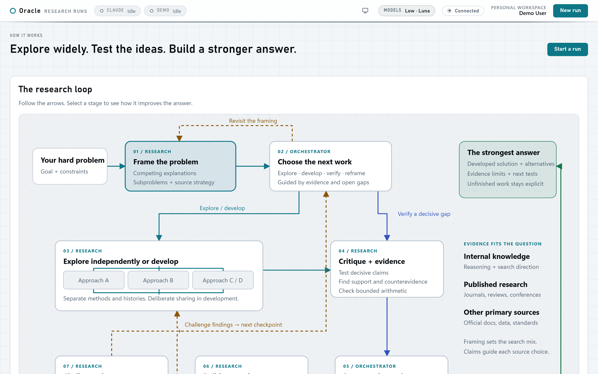
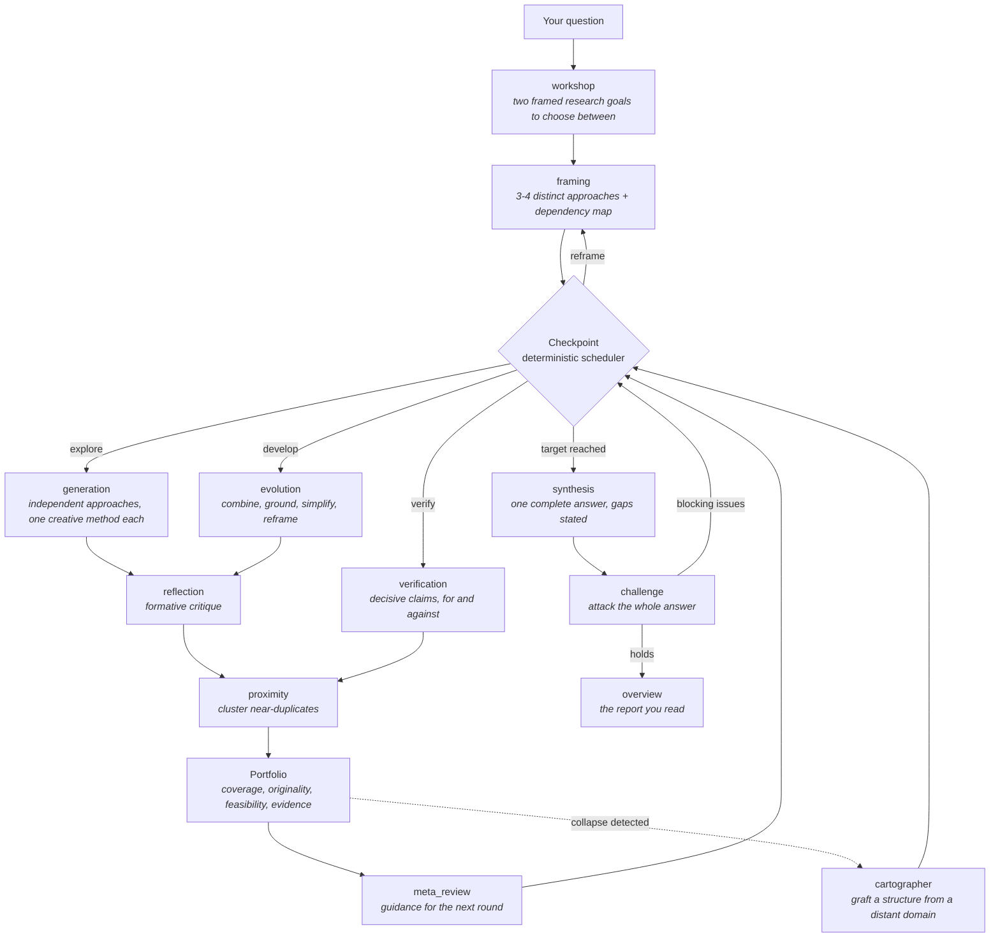
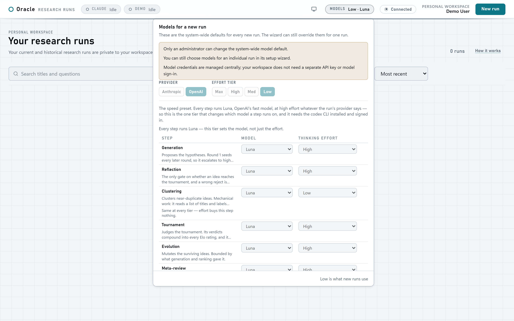
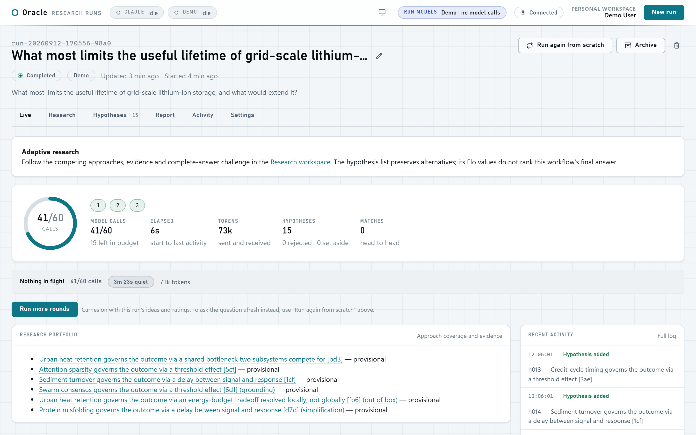
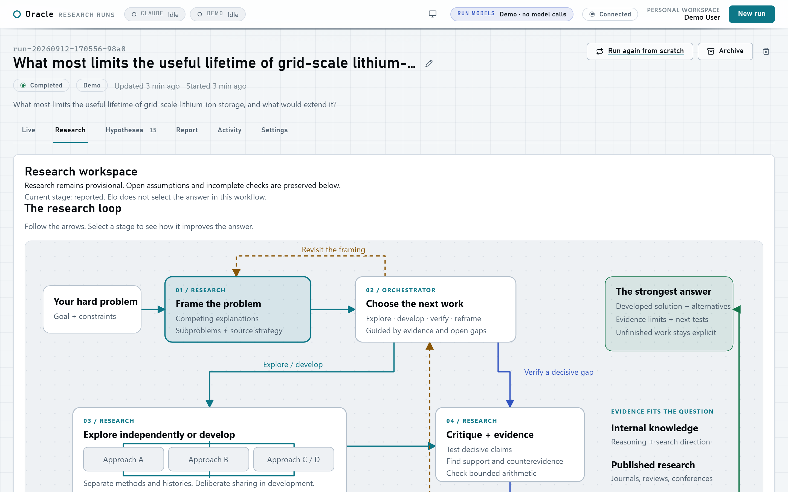
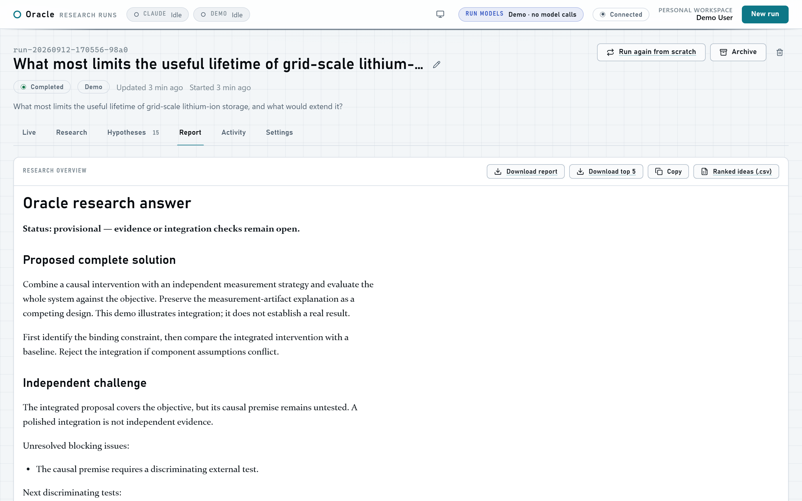
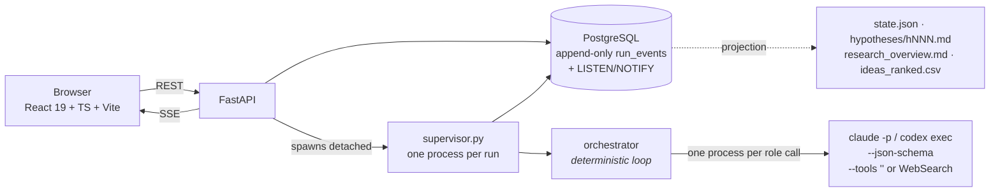

<div align="center">

# Oracle

**A multi-agent research engine that develops competing approaches to a hard question, verifies their evidence, integrates a complete answer, and then attacks it.**

[](https://github.com/JayjBee13/oracle-coscientist/actions/workflows/ci.yml)
[](LICENSE)
[](https://www.python.org/)
[](https://nodejs.org/)

Built on the AI co-scientist workflow, with **novelty injection** added.<br>
Runs on the **Claude Code** and **Codex** CLIs — subscription harnesses, no API key.

</div>

---

A question goes in the way you would say it out loud — *"what most limits the useful
lifetime of grid-scale lithium-ion storage, and what would extend it?"* — and what comes
back is a report: the competing explanations, what the evidence says for and against each,
one integrated answer, and the strongest case anyone could make against that answer. You
watch every step arrive live, and you can steer it, pause it, extend it or stop it.

In between, a bounded loop of specialised agents does the work: framing the problem several
ways, exploring each independently, criticising without pruning, verifying the decisive
claims, keeping a diverse portfolio, integrating, and then attacking what it integrated.
Nothing in the engine encodes a field, so the same method takes a mechanism in biology, a
market's real driver or an engineering trade-off.

**One honest caveat, stated up front:** process completion is not proof of correctness.
Oracle produces well-supported, creative, explicitly-caveated answers. It does not run
experiments, it does not execute code, and a favourable challenge is not empirical
validation. Unknowns stay unknown, on screen and in the report.



**In a hurry:** [what to ask it](#what-do-you-actually-ask-it) ·
[install](#install) · [try it free](#your-first-run-costs-nothing) ·
[what it costs](#models-depth-and-cost)

## What do you actually ask it?

Anything you would take to a sharp colleague and expect an argued answer to, rather than a
fact you could look up. Oracle is for questions with **more than one defensible answer**,
where you want the alternatives developed and attacked rather than a single confident
paragraph.

| Ask | Why it suits Oracle |
| --- | --- |
| *What most limits the useful lifetime of grid-scale lithium-ion storage, and what would extend it?* | Several real mechanisms compete; the interesting output is which one binds first, and what would distinguish them. |
| *Our B2B trial-to-paid conversion collapses in week three. What are the plausible causes, and which one would we test first?* | Forces rival explanations instead of the first plausible story, and ends with a discriminating test. |
| *Should this service shard by tenant or by time? Argue both, then say what evidence would settle it.* | An engineering trade-off with no universal answer — exactly what the adversarial challenge is for. |
| *What mechanisms could link sleep fragmentation to glycaemic control, and which is most testable in a small study?* | Mechanism-hunting across a literature, with the evidence check recording what contradicts each one. |
| *Why does the office coffee taste worse on Mondays? Propose mechanisms and a test that fits in one week.* | Genuinely silly, and a perfect first real run: small, bounded, and you can check the answer yourself on Monday. |
| *What is the best path from $100 of starting capital to $50,000,000, and what kills each route?* | Go ahead. This is the honest stress test — see below. |

**What you get back** is a report, not a chat log: a status line saying whether the answer
is ready or still provisional, the proposed complete solution, the independent challenge
with its unresolved blocking issues, the next discriminating tests, and the alternatives
that were kept rather than pruned — plus the ranked ideas as CSV and a top-five export.
There is a real one [further down](#your-first-run-costs-nothing).

**On that last row** — this is design intent, not a run I am quoting: an under-specified
objective, and a route whose expected value hides a ruin probability near one, are exactly
what the challenge role exists to name. Expect a caveated portfolio with its assumptions
stated. If Oracle ever hands you a confident plan for that question, that is the bug.

**A good question states the objective and the constraints.** Vague in, vague out: "how do
I grow revenue" gets you a framework, while "which of our three acquisition channels is
most likely to be the constraint at 10× volume, given we cannot increase headcount" gets
you an argument. It is not a search engine, it does not run experiments or execute code,
and it is at its best where the answer is *contested* rather than merely unknown to you.

## How a run works



Every box is a separate, stateless call to a model with a fixed job and a fixed output
shape. Nothing is a conversation; nothing carries hidden state between calls. The loop
itself lives in Python.

## The agents

Thirteen roles. Each is one process, one prompt, one JSON schema, and either no tools at
all or web search and nothing else.

| Agent | What it does |
| --- | --- |
| **workshop** | Turns a rough question into two properly framed research goals with different strategies, before a run exists. You pick one, merge them, or edit the result. |
| **framing** | Preserves your objective while creating several distinct ways to understand the problem, plus a map of separable subproblems and their acceptance tests. |
| **generation** | Proposes the hypotheses. Calls run in parallel on deliberately different angles and creative methods, so the ideas do not all rhyme. Can search the web. |
| **reflection** | Formative critique of each new idea — novelty, correctness, testability, key risk. Rejects only for a fundamental flaw, never for being unfashionable. Can search the web. |
| **proximity** | Clusters ideas by what they actually claim, so near-duplicates are marked as duplicates instead of quietly winning twice. Mechanical work, deliberately cheap. |
| **ranking** | *Tournament workflow only.* Judges pairs head-to-head with written reasoning; the winner takes Elo from the loser. Pairings are adjacent-in-standings and never within a cluster. The default adaptive loop selects a portfolio instead, and runs no Elo. |
| **evolution** | Derives new ideas from survivors by grounding, combination, simplification or an out-of-the-box reframe. Parents are never mutated — lineage is preserved. |
| **meta_review** | Reads every review and debate from the round and writes the guidance the next round is generated against. This is the loop's memory. |
| **cartographer** | Novelty injection. Fires only on measured collapse, grafts a structural skeleton from an unrelated domain into the next generation. |
| **verification** | Independently checks decisive claims and records supporting *and* contradicting sources, open assumptions, and the next discriminating test. Can search the web. |
| **synthesis** | Integrates a diverse portfolio into one complete answer: how the parts fit, which dependencies they resolve, what competes, what is still missing. |
| **challenge** | Attacks the finished answer against the original objective and reopens decisive weaknesses. Blocking findings send the run back to the scheduler. |
| **overview** | Writes the report a person actually reads. Its calls are reserved up front, so a stopped or budget-capped run still produces one. |

## What makes it different: novelty injection

A co-scientist loop that only generates, reviews and ranks will converge. Each round is
conditioned on the last round's winners, so the pool narrows, the surviving ideas start to
rhyme, and the tournament keeps re-electing the same framing with better prose. Oracle adds
three mechanisms that deliberately push against that:

| Mechanism | What it does |
| --- | --- |
| **Four rotating creative methods** | Every exploration call is assigned one of *first principles*, *assumption inversion* (reverse a pivotal assumption and develop the strongest feasible result), *structural analogy* (transfer a causal structure from a distant field, then test where it breaks), or *recombination*. Exploration calls never see each other's winning narratives, so they cannot converge by imitation. |
| **The Cartographer graft** *(off by default — `graft.enabled`; worth turning on for runs of five rounds or more)* | A structural skeleton taken from an *unrelated domain* and seeded into the next round's ideas. It fires only when the pool measurably collapses: the ideas cluster into fewer and fewer distinct claims, their ratings stop moving, and genuinely new ones stop appearing. How many of those three signals must agree, over how many rounds, and how long before it may fire again, are all settings — their defaults come from replaying earlier runs through the detector. |
| **Enforced breadth recovery** | The scheduler is deterministic code, not model discretion: after any round of targeted work (develop, verify, reframe) the next action is *always* fresh exploration. Early confidence cannot monopolise the search. |

Criticism is **formative** rather than eliminating: a review that finds a weakness does not
retire the idea, it tells the next call what to fix. An idea the evidence contradicts stays
in the record too — it is simply left out of the portfolio the final answer is built from,
rather than deleted.

## Models, depth and cost

Oracle drives **CLI harnesses on subscriptions** rather than a metered API. That is the
central cost decision, and it shapes the engine:

- One **stateless process per role call** — `claude -p …` or `codex exec …`. No session, no
  shell, no filesystem, no MCP servers.
- The output shape is enforced by the CLI (`--json-schema`) and re-validated on the way back
  in, so a role cannot answer with prose where the engine expected a hypothesis.
- **There is no API key anywhere in this system.** You sign the CLIs in once, with your own
  Claude and ChatGPT subscriptions.
- Because nothing is billed per token, **reasoning effort buys thinking with latency, not
  money**. That is why effort and model are separate dials here: a deeper run costs minutes,
  not dollars.

Five models are selectable, two classes, two providers. Anthropic list prices are quoted in
[`docs/models-and-cost.md`](docs/models-and-cost.md) as of 2026-08-08; the OpenAI pair has no
per-token price to quote, because Codex runs on a ChatGPT account:

| Model | Provider / CLI | Class | Use it for |
| --- | --- | --- | --- |
| `gpt-5.6-luna` — Luna | OpenAI / `codex` | light | **The cheapest way to run Oracle.** On a subscription the scarce resource is your rate limit and your afternoon, not dollars — Luna answers fastest and consumes least of both. The whole `Low` tier pins every role to it. |
| `claude-opus-5` — Opus 5 | Anthropic / `claude` | light | The floor, the workhorse, and the baseline every price is quoted against. |
| `gpt-5.6-sol` — Sol | OpenAI / `codex` | heavy | The Codex side's judge: the roles whose verdicts compound. |
| `gpt-6-astra` — Astra | OpenAI / `codex` | heavy | The heaviest OpenAI option, for the hardest reasoning and complete-solution work. |
| `fable` — Fable 5.1 | Anthropic / `claude` | heavy | The strongest option, for demanding reasoning and long-running work. |

> Model ids are a **closed allowlist**, pinned with no fallback: a silent downgrade
> mid-tournament would poison Elo with verdicts from a different judge. `fable` is the
> identifier a config holds; `claude-fable-5-1` is what reaches `--model`. On Anthropic calls
> the engine also checks which model actually answered. See
> [`docs/models-and-cost.md`](docs/models-and-cost.md).

**A role's class never moves, and no swap is invisible.** Heavy is the judgement that
compounds across a run (generating, reviewing, ranking, guiding, reporting); light is
bounded work the next step re-derives anyway (clustering, mutating, grafting, shaping a
question). What the engine refuses is a *silent* substitution — a heavy step quietly
answered by its provider's fast model. There is exactly one deliberate exception, and it is
the opposite of silent: the **Low** tier pins every role to Luna, says so on the tier, and
prints Luna on every row of the table you confirm before launching.

### Levels (tiers)

| Tier | Heavy effort | Light effort | Notes |
| --- | --- | --- | --- |
| **Max** | `xhigh` | `high` | The strongest run, and the slowest. |
| **High** | `high` | `medium` | The default shape: strong where judgement compounds, quick elsewhere. |
| **Med** | `low` | `low` | Thinks less — never thinks with something weaker. |
| **Low** | `high` | `high` | Not a rung on this ladder — the **speed** preset. Every role runs **Luna** at high effort, whatever the run's provider, so it thinks hard and answers fast. Needs the `codex` CLI signed in. |

`proximity` is held at `low` in every tier, because thinking buys clustering nothing.

### Per-agent model selection

Every one of the thirteen roles can be overridden individually — model, effort, or both —
and a row may name **either provider's** model regardless of the run's provider. Mixing
providers inside one run is the point of the feature, not an accident of it. Put Fable 5.1
on `synthesis` and `challenge`, Luna on everything else, and the resolved table is printed
before you spend anything.

Overrides are set system-wide in the top bar's **Models** control, or per run in the
wizard's Settings step. Both read one contract (`GET /api/capabilities`), so the picker can
never offer a model the engine would refuse, and the effort ladder is read off the selected
*model* rather than its provider.



## Configuration

Rounds and levels are configurable, along with everything else that decides how deep a run
goes. Set per run in the wizard, or via `POST /api/runs`:

| Setting | Range | Default | What it changes |
| --- | --- | --- | --- |
| `workflow` | `adaptive` \| `tournament` | `adaptive` | The loop itself. Tournament is the earlier Elo workflow, kept for comparison. |
| `rounds` | 1–25 | 5 | Checkpoints. Each one runs a scheduler decision and its work. |
| `generation_batch` | 1–40 | 8 | Ideas proposed per exploration round, split across parallel calls. |
| `matches_per_round` | 0–100 | 6 | Tournament pairings judged per round. |
| `evolve_top_k` | 0–25 | 3 | How many survivors development derives from. |
| `grounding_depth` | `shallow` \| `standard` \| `deep` | `standard` | How hard grounded roles work to verify claims. `deep` verifies every major claim independently. |
| `model_tier` | `max` \| `high` \| `med` \| `low` | system default | The effort level (above). |
| `provider` | `anthropic` \| `openai` | system default | Which provider fills the rows you do not override. |
| `model_overrides` | per role | — | Model and/or effort for any of the thirteen roles. |
| `budget_calls` | 1–10 000 | 150 | **The governor.** The ceiling that actually stops a run, enforced in the store *and* re-checked at the spawn layer. |
| `budget_usd` | optional | off | An API-equivalent dollar ceiling, for metered setups. |
| `wall_clock_minutes` | optional | off | Elapsed-time ceiling. Ends the run the way `finish` does — the report is written first. |
| `graft.enabled` | bool | `false` | Novelty injection on/off. |
| `graft.quorum_k` / `window` / `cooldown` | 1–3 / 1–10 / 0–10 | 3 / 3 / 2 | How many collapse signals, over how many rounds, and how long before it may fire again. |

Three presets set all of it at once — **Quick look** (1 round, 3 hypotheses, 2 matches,
shallow), **Standard** (3 / 6 / 4, standard), **Deep** (5 / 8 / 6, deep) — and the Confirm
step shows the resolved per-role model table, the estimated call count and wall-clock, and
both hard ceilings, before you launch.

## Install

### Requirements

- **Docker** with Compose v2 (the one-command path), or **Python 3.12+**, **Node 24+** and
  **PostgreSQL 17** for a local install.
- The **[Claude Code CLI](https://github.com/anthropics/claude-code)** signed in, for Anthropic
  models, and/or the **[Codex CLI](https://github.com/openai/codex)** signed in, for OpenAI
  models. Only needed for *real* runs — the demo runner needs neither.

### Docker (recommended)

```bash
git clone https://github.com/JayjBee13/oracle-coscientist.git
cd oracle-coscientist
cp docker/.env.example  docker/.env
cp docker/db.env.example docker/db.env   # both work as shipped: change nothing for a first run
docker compose up -d --build
docker compose run --rm --no-deps app alembic upgrade head
```

That brings up PostgreSQL, the application (which serves both `/api/*` and the built
frontend) and an nginx front end, then applies the migrations. **The first build is slow** —
it installs both CLIs and builds the frontend from source; allow several minutes and a few
GB.

Open **http://localhost:18000** — that is the app. Port **18001** is the application
directly, bound to loopback for `curl http://localhost:18001/api/health`; you do not browse
it.

The database is created on first boot only, from `docker/init-db.sh` against an empty
volume, so passwords in `docker/db.env` are read then and never again. To start over:
`docker compose down && docker volume rm oracle_db`.

To use real models, sign the CLIs in inside the container's home volume and set
`REAL_HARNESS_ENABLED=true` in `docker/.env`:

```bash
docker compose exec app claude login     # and/or: docker compose exec app codex login
docker compose restart app
```

Both are interactive device-code flows: the CLI prints a URL, you approve it in your own
browser, and the token lands in the container's home volume, where it survives rebuilds.

Full details, including the read-only root filesystem, credential isolation and rollback, are
in [`docs/docker-deployment.md`](docs/docker-deployment.md).

### Local development

```bash
git clone https://github.com/JayjBee13/oracle-coscientist.git
cd oracle-coscientist
cp .env.example .env
```

Create the database Oracle owns. The name and role are asserted by both the migrations and
the tests, so they are not optional:

```bash
psql -U postgres -c "CREATE ROLE ai_coscientist_gui_app LOGIN PASSWORD 'changeme';"
psql -U postgres -c "CREATE DATABASE ai_coscientist_gui OWNER ai_coscientist_gui_app;"
```

Point `DATABASE_URL` in `.env` at it, then:

```bash
# backend, from ./backend
python -m venv .venv
.venv/bin/pip install -e ".[dev]"        # Windows: .venv\Scripts\pip.exe
.venv/bin/alembic upgrade head
.venv/bin/python -m uvicorn app.main:app --host 127.0.0.1 --port 8787

# frontend, from ./frontend
npm install
npm run dev
```

Open **http://localhost:5173**.

> On Windows a bare `python` on PATH will not work — every dependency lives in
> `backend\.venv`, so spell the interpreter out as `.venv\Scripts\python.exe`.

For deployment, build the frontend instead of serving it: `npm run build` emits
`frontend/dist`, which the API process mounts and serves alongside `/api/*`.

## Your first run costs nothing

Oracle ships a **demo runner**: a scripted model that produces a complete, plausible run —
hypotheses, reviews, clusters, a tournament with real Elo movement, a report — with no
network calls and no cost.

Launch from **New Run** and pick **Run as demo** on the Confirm step. Set
`COSCIENTIST_DEMO_LATENCY=2` first if you want to watch the live view fill up at a human
pace instead of finishing before the page settles. This is the right way to learn the
interface, and it is what the automated browser smoke exercises end to end.



The Research tab is where an adaptive run explains itself — the approaches it is holding,
the dependencies between them, the evidence it has checked, and the decision it took at each
checkpoint:



And the report keeps the challenged answer together with what is still open, rather than
replacing it with a clean rewrite:



> The screenshots above are a **demo** run: the scripted runner produces the full shape of a
> run — rounds, reviews, portfolio, challenge, report — with placeholder findings and no
> model calls. A real run has the same interface and real content.

## A real run

1. Set `REAL_HARNESS_ENABLED=true` and restart the backend. Real runs are opt-in by design.
2. **New Run** → type the question in your own words. The workshop returns two framed
   research goals; pick, merge, regenerate with a note, or edit the final prompt.
3. Attach context documents if you have them (`.md`, `.txt`, `.csv`, `.json`; 200 KB each,
   five max). They are inlined into the generation, reflection, evolution and cartographer
   prompts.
4. Choose a preset, or set rounds, batch, matches, grounding, tier and per-role models
   yourself.
5. Confirm. You see the resolved model table, the call estimate, the wall-clock estimate and
   both ceilings. Two overview calls are reserved so a run that hits its budget still
   reports.
6. Launch. Events stream in live; you can pause, note (your note becomes top-priority
   guidance next round), archive an idea you do not believe, extend the run in place, or
   stop it. **Stopping still writes the report from whatever exists.**

## Architecture



The design decision everything else follows from: **the loop lives in deterministic Python,
not in a model's head.** The orchestrator decides what happens next, in what order, with
what budget. The model is called as a function.

Everything the engine knows lives in Postgres. `run_events` is append-only and is the single
source of truth; a database trigger `NOTIFY`s on insert, the backend holds one listener and
fans events out to every watching browser over Server-Sent Events. The files on disk are a
*projection*, written so results stay readable outside this app — they are never read back
as engine state.

More detail: [`docs/architecture.md`](docs/architecture.md).

## Safety model

These rules are not stylistic. Each exists because ignoring it broke something.

- **The model never gets a shell.** No Bash, no Read, no Write, no Edit, no Task. Judging
  roles get `--tools ""`; grounded roles get `--tools "WebSearch"` and nothing else.
- **`--tools` is availability, not permission.** `--allowedTools` must mirror it, or a
  grounded call is denied after burning the whole prompt. The fix for a denial is correcting
  `--allowedTools`, *never* weakening the permission mode.
- **Every call passes `--strict-mcp-config`.** Suppressing setting sources does not suppress
  MCP servers; without this flag the host operator's own connectors appear inside research
  calls.
- **WebFetch is never used.** It reaches loopback and the local network. WebSearch grounds
  the work with citations and does not.
- **Two ceilings, re-checked at spawn**, so a budget survives an orchestrator bug. There is a
  red **Stop all** in the app shell that halts every active run.
- **Path confinement**: a run may only write inside its own workdir, and no recorded spawn
  argv may contain a secret. The safety doctor asserts both.
- The container runs **read-only, non-root, `cap_drop: ALL`, `no-new-privileges`**, with
  credentials in an isolated volume.

Report a vulnerability privately: [`SECURITY.md`](SECURITY.md).

## Verification

Three gates, in increasing order of commitment. **They are PowerShell scripts** — the
project was developed on Windows, and porting them is an open invitation. CI covers the same
ground on Linux without them, and the container smokes below are plain Python.

```powershell
# 1. Read-only safety check. Never launches a model. 7 checks.
powershell -File scripts/smoke/safety_doctor.ps1

# 2. The full gate. Costs nothing — the only run it launches is a demo run.
powershell -File scripts/smoke/fake_full_stack.ps1

# 3. The only script that spends anything. Refuses to run without the guard.
$env:ALLOW_REAL_HARNESS_SMOKE = "YES"
powershell -File scripts/smoke/real_tiny_smoke.ps1
```

`fake_full_stack.ps1` runs eight steps: safety doctor, backend tests, ruff, frontend lint,
frontend tests, frontend build, the OpenAPI regeneration no-diff check, and a Playwright
walkthrough that launches a demo run, watches it live, pauses it, notes it, finishes it,
reads the report, compares two runs and checks the error states with the backend stopped.

`real_tiny_smoke.ps1` is the one that spends money, and the only gate that exercises a real
model end to end. It drives one bounded real run and checks what actually matters: that
hypotheses came back, that the ledger reconciles, that a grounded call really searched the
web, that nothing was written outside the run's workdir, and that no call was denied a tool
it had been granted. It refuses to run without `ALLOW_REAL_HARNESS_SMOKE=YES` in the
environment — an environment variable rather than a flag, so a stray command line cannot
trigger it.

CI ([`.github/workflows/ci.yml`](.github/workflows/ci.yml)) runs ruff, the backend suite
against a real PostgreSQL service, and the frontend lint/typecheck/test/build plus the
OpenAPI no-diff gate. It makes no model calls, so it is free.

## Repository layout

| Path | What it is |
| --- | --- |
| `backend/app/engine/` | The research engine. Every module carries a long docstring explaining why it is the way it is — read it before changing the module. |
| `backend/app/services/` | Run lifecycle, event streaming, the prompt workshop, comparison analytics. |
| `backend/app/api/` | Routing, validation and error envelopes only. It does not know SQL. |
| `frontend/src/` | React 19 + TypeScript. `api/schema.ts` is generated from the backend's OpenAPI. |
| `prompts/` | The prompt packages handed to each CLI, and the JSON schemas that bound their answers. |
| `archive/engine-source/` | The original v1 and v2 engines and their role prompts, kept byte-exact. A unit test diffs today's prompts against them, so the passages that had to survive the port provably still say what they said. |
| `docker/`, `compose.yaml` | The containerised deployment. |
| `scripts/smoke/` | The three verification gates. |
| `docs/` | Architecture, agents, models and cost, configuration, deployment. |

## Lineage and attribution

Oracle is an independent implementation of the multi-agent research pattern described in
**[Towards an AI co-scientist](https://arxiv.org/abs/2502.18864)** (Google, 2025) — the
generation / reflection / proximity / ranking / evolution / meta-review loop with an Elo
tournament — extended with the novelty-injection mechanisms described above, an adaptive
deterministic scheduler, evidence verification, synthesis and adversarial challenge.

This project is **not affiliated with or endorsed by Google, Anthropic or OpenAI**. Use of
the Claude Code and Codex CLIs is subject to those vendors' own terms; be sure your intended
use is permitted under the subscription you sign in with. See [`NOTICE`](NOTICE).

## Contributing

Issues and pull requests are welcome — please read [`CONTRIBUTING.md`](CONTRIBUTING.md)
first. The engine's rules in [Safety model](#safety-model) are non-negotiable, and a change
to a prompt asset that breaks the archive diff test will be refused.

## License

[Apache License 2.0](LICENSE).
