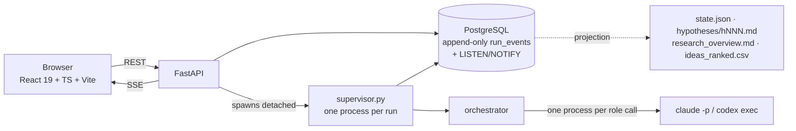

# Architecture

The design decision everything else follows from: **the loop lives in deterministic Python,
not in a model's head.** The orchestrator decides what happens next, in what order, with
what budget. A model is called as a function — one process per call, no session, no shell,
no filesystem, a JSON schema on the way out.

An earlier version of this project asked a model to drive the whole process by running
commands, and it improvised destructive ones. That approach is not coming back.

## Processes

Launching a run creates the row and then **detaches** a supervisor:
`python -m app.engine.supervisor --run-id <uuid>`. The API process does not run research;
it starts it and then reads the same event stream everyone else reads. That is why
restarting the API does not kill a run, and why a container deployment has to opt in to
managing supervisors on shutdown (`MANAGE_SUPERVISORS_ON_SHUTDOWN`).

## State

Everything the engine knows lives in PostgreSQL. **`run_events` is append-only and is the
single source of truth for what happened.** A database trigger `NOTIFY`s on insert; the
backend holds one `LISTEN` connection per process and fans events out to every watching
browser over Server-Sent Events. A client that connects late gets replay first, then live,
with nothing lost in between.

Files on disk are a **projection**: `state.json`, `hypotheses/hNNN.md`,
`research_overview.md`, `ideas_ranked.csv`, written so results stay readable and portable
outside this app. The projection is lossy and is **never read back as engine state**.

`EventWriter` rejects an event type that is not in the canonical vocabulary before the row
is written, so the stream cannot acquire an event the frontend has never heard of.

## The engine modules

`backend/app/engine/`. Each module carries a long docstring explaining why it is the way it
is — read the docstring before changing the module.

| Module | Responsibility |
| --- | --- |
| `core.py` | Pure engine math: Elo, pairing, collapse signals, budget estimates. No I/O of any kind, so decisions are testable and a resumed run is reproducible. |
| `research.py` | The adaptive controller. Versioned research state, checkpointed before materialization, with deterministic candidate UUIDs so an interrupted insert is safe to replay. |
| `research_contracts.py` | Bounded schemas, reference checks, conservative evidence assessment, bounded arithmetic, portfolio selection, and `next_action` — the scheduler. |
| `store.py` | Transactional access to engine state. `RunStore` is the only writer of the engine tables. |
| `orchestrator.py` | The supervisor loop: deterministic code driving probabilistic workers. Owns every mutation; roles only return data. |
| `runners.py` | How the engine calls a model: `AgentRunner`, `RoleConfig`, `RoleResult`, the per-role class/tier/tools table, and `FakeRunner`. |
| `routing.py` | `ProviderRouter` picks the runner per call from that row's own model — which is how one run can execute across both CLIs. |
| `claude_runner.py` / `codex_runner.py` | Each CLI as a stateless function call, with invariants asserted from the process's own init envelope. |
| `spawn.py` | The one place this application starts a model process. Resolves past the npm shim, confines cwd, rejects `://` in argv, re-checks the budget. |
| `supervisor.py` | One detached process per run. Owns the heartbeat and the terminal lifecycle write. |
| `models.py` | The model allowlist, classes, prices, effort ladders and the substitution guard. The published contract for everything the UI shows about models. |
| `prompts.py` + `prompt_assets/*.md` | Role system prompts and the per-call task prompts. |
| `schemas.py` | The JSON contract every role must satisfy, handed to the CLI and re-validated on the way back in. |
| `events.py` | The canonical `run_events.type` vocabulary and each type's payload. |
| `projection.py` | Projects a run onto disk as the files described above. |
| `calibration.py` | Replays archived runs through the collapse detector to calibrate the graft. Needs a run archive of your own. |

Above the engine, `app/services/` holds the run lifecycle (`runs/launcher.py`,
`controls.py`, `importer.py`, `reads.py`, `paths.py`), event streaming (`events/listener.py`,
`stream.py`, `tickets.py`), the prompt workshop, artifact discovery and comparison
analytics. `app/api/` is routing, validation and error envelopes only — it does not know
SQL.

## The adaptive loop

`next_action` is a bounded scheduler with explicit breadth recovery rather than model
discretion. In order:

1. No approaches established yet → **explore**.
2. The challenge disputes a problem assumption → **reframe**.
3. The previous checkpoint did targeted work (develop, verify or reframe) → **explore**,
   unconditionally. This is what stops early confidence from monopolising the search.
4. The challenge found blocking issues → **develop** or **verify**, as it asked.
5. Otherwise → **develop**.

Exploration calls see their own framing and their own previous work — never other
approaches' winning narratives — and each is assigned one of four creative methods: first
principles, assumption inversion, structural analogy, recombination.

Formative reflection does not automatically retire an adaptive candidate. Contradicted
candidates stay in the record but are excluded from the recommendation portfolio, and the
report preserves the challenged synthesis together with its deterministic caveats: missing
checks, contradictions, withdrawn candidates and changed guidance all prevent a stale answer
from being presented as ready.

## The tournament loop

The earlier workflow, still selectable and still what unversioned historical runs resume
into. Each round runs generation → reflection → proximity → ranking → evolution →
meta-review. Ranking is a real tournament: pairs argued head-to-head by a judge that writes
out its reasoning, with the winner taking Elo from the loser; pairings are
adjacent-in-standings, seeded, and never within a cluster. Meta-review reads every review
and every debate from the round and writes the guidance the next round is generated against
— the loop's memory.

## Novelty injection

Two mechanisms, on top of the four rotating creative methods:

- **Enforced breadth recovery**, described above: rule 3 of the scheduler.
- **The Cartographer graft.** `core.collapse_signals` measures cluster concentration, Elo
  plateau and the birth rate of genuinely new ideas. `should_fire_graft` requires a quorum
  of those signals across a window of rounds, with a cooldown after firing. When it fires,
  the cartographer fetches a structural skeleton from an unrelated domain and seeds the next
  generation with it. Off by default; the parameter grid was calibrated by replaying real
  run history rather than chosen by feel.

## Budgets and failure

A run is bounded by **two** ceilings — `budget_calls` and optional `budget_usd` — enforced
in the store and **re-checked at the spawn layer**, so the cap survives an orchestrator bug.
An optional `wall_clock_minutes` ends the run the way the `finish` control does: the
overview is written first. Two overview calls are reserved up front, so a run that exhausts
its budget still produces a report.

Stopping is always safe: **stopping still writes the report from whatever exists.** A crash
reconciler parks runs whose supervisor died so they can be resumed, and `continue` extends a
completed or stopped run **in place** — same run id, keeping every hypothesis, Elo, match,
cluster, note and graft state, opening the next round on the previous round's meta-review
guidance. It is the single sanctioned exception to a run's config being immutable after
launch, it may touch only `rounds` and `budget_calls`, and every extension writes a
`run_extended` event recording both sides of both numbers.

## Frontend

React 19 + TypeScript + Vite. `src/api/schema.ts` and `openapi.json` are **generated** from
the backend (`npm run gen:api`), and CI fails on a diff — the API contract is never
hand-written on the client. The run detail view advances its genealogy graph from the SSE
events the store already holds rather than refetching per event.

In deployment the built frontend is served by the API process itself (`WEB_DIST_DIR`):
`/api/*` is never swallowed by the SPA fallback, so a mistyped endpoint still 404s as JSON,
while every other path returns `index.html`.
