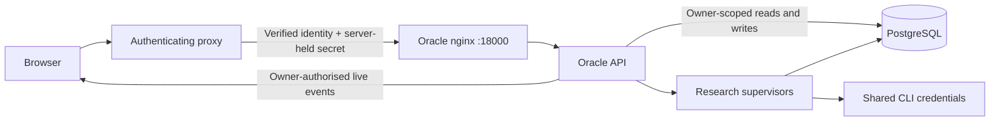

# Private workspaces

One shared deployment, per-user ownership. The proxy authenticates the person; Oracle
authorises access to their research. Users do not get a second password and do not need
their own model subscriptions.

Configuring the proxy is [`reverse-proxy-sso.md`](reverse-proxy-sso.md). This document is
what ownership means once it is configured.

## Identity and access

The stable username from the verified session selects a persistent user row. Runs,
artifacts, hypotheses, comparisons, lifecycle controls, event streams, tickets and prompt
workshops are all ownership-checked.

A request for another ordinary user's resource returns **`404`, not `403`** — the existence
of someone else's run is itself private.

The configured administrator group is the explicit exception. Administrators can inspect
every workspace and change the global model defaults. Ordinary users can choose models for
their own research without touching those defaults. An administrator's lists open on **My
runs**; **All users** is a deliberate selection, never the default view.

Outside strict mode the single-operator fallback remains: every request is
`LOCAL_IDENTITY_USERNAME`, which is the right setting for a personal install.

## Browser privacy

- The app displays the verified account and sends a missing or expired session back through
  the gateway.
- Private in-memory data is cleared when identity fails or changes — including responses
  that arrive late and live streams that were already open.
- Draft storage is scoped by username. A legacy draft with no known owner is never
  auto-assigned to a newly signed-in account.
- Private API responses are marked so they cannot be stored in a shared or browser HTTP
  cache.
- In strict mode, the `Origin` of a browser write is checked against the configured public
  origin.

## Shared execution

Model access and execution capacity are shared; histories are private. The CLI credentials
live in one server-side volume and are never supplied to, or exposed to, a user.

When a provider lane is occupied, a request gets a **busy response that discloses nothing** —
not the other run's title, not its owner. There is no per-person container and no waiting
queue.

## What this is, and what it is not

This is **application-level** workspace separation. The database, the application process,
the filesystem and the credential store remain shared infrastructure under the operator's
control, and administrators deliberately retain broader access.

It is not a tenancy boundary. Do not use it to separate parties who must not be able to
affect each other's work: a single deployment shares a rate limit, a process, a disk and a
set of credentials. For that, run separate deployments.
